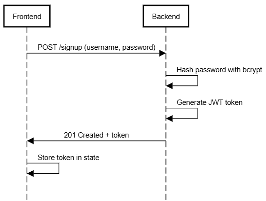

## BranchBeasts

## Project Blurb

myCloset is an inventory style web app to help users organize
their closets. The main features of the app are the closet,
where you can see all your clothes in one place, and the outfit
creator / page. Instead of going through drawers in a dresser to
see your t-shirt options, you can just scroll through myCloset
and know what you have. The outfit generator allows you to
randomly generate, create, and save outfits so you know what you
can wear! In the future we hope to add more advanced sorting
features like sorting by color, image processing so that all
clothing images uploaded to the site have no background, and
social features like posting your daily outfit, and seeing what
friends are wearing.

## 🔐 Sequence Diagrams

### 1. Sign-up Flow

### 2. Login Flow

### 3. Protected Fetch Flow

Azure Continuous Deployment Webiste Link!
https://witty-wave-004c6611e.6.azurestaticapps.net

## Testing

Jest testing the upload item form

## UI Prototype

https://www.figma.com/proto/ISQq5s8dksJvmpQcs5y7I0/BB---Clickable-Prototype?node-id=3-847&t=NI1wTtfiCqRqwTfW-0&scaling=scale-down&content-scaling=fixed&page-id=0%3A1&starting-point-node-id=1%3A844

## Development Environment Setup

Continuous integration through github actions handles most of
the environment setup for this project. An overview of the CI
process -

1. Run npm CI
2. run npm lint on frontend and backend
3. run npm build frontend Users running on local need to run npm
   run dev (on backend), npm run dev (on frontend), and npx
   @tailwindcss/cli -i ./src/input.css -o ./src/output.css
   --watch (on frontend)
